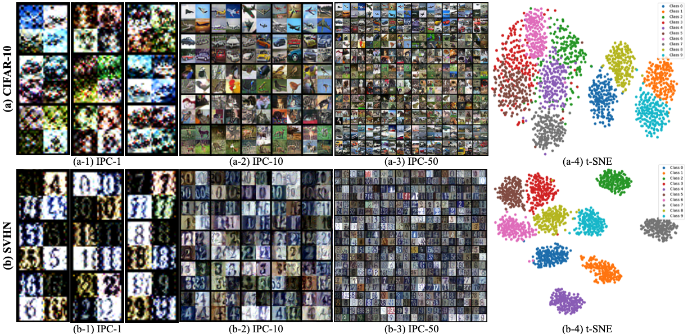

# BACON: Bayesian Optimal Condensation Framework for Dataset Distillation
Official PyTorch implementation of **"[BACON: Bayesian Optimal Condensation Framework for Dataset Distillation](https://arxiv.org/)"**, submitted to **NeurIPS'25**



> **Abstract** *Dataset distillation, also known as dataset condensation, is an innovative technique designed to distill knowledge from extensive datasets into more compact ones while maintaining comparable performance on the test set. This approach is crucial for addressing issues related to data storage and training expenses. Common methods facilitate knowledge transfer by matching gradients, embedding distributions, or training trajectories of synthetic images to those of the initially sampled images. We argue that an appropriate theoretical framework to evaluate the distillation performance of dataset distillation is non-trivial but has not been considered in previous works. Thus, we propose the <u>**BA**</u>yesian optimal <u>**CON**</u>densation framework (<u>**BACON**</u>), which, to the best of our knowledge, is the first work to introduce the Bayesian theoretical framework to the literature of dataset distillation, providing the theoretical support for evaluating its distillation performance. Furthermore, BACON utilizes the Bayesian framework to formulate the dataset distillation problem as the minimization of the expected risk function in joint probability distributions. Additionally, we analyze the expected risk function for optimal condensation and derive a numerically feasible lower bound based on certain assumptions to obtain the approximated solution for BACON. We validate the proposed BACON on several datasets, and the experimental results demonstrate its superior performance compared to existing state-of-the-art methods. For instance, on the SVHN dataset, BACON achieves a performance gain of up to 38%. Our extensive experiments confirm the effectiveness of BACON and its seamless integration as a plug-and-play module into existing state-of-the-art methods, effectively enhancing their performance for the dataset distillation task. We will release our code upon acceptance at [BACON](https://github.com/zhouzhengqd/BACON).*

## Basic results ([Data Drive](https://drive.google.com/drive/folders/1yh0Hf2ia4b-1edMiAr1kXCH4eUcYNfmz?usp=sharing))
Top-1 test accuracies with ConvNet-3 on the multiple datasets.
### Comparison to the State-of-the-art Methods
- **IPC-50**

| Method | MNIST | Fashion-MNIST | SVHN | CIFAR-10 | CIFAR-100 | Tiny-ImageNet |
| :------: | :-----:  | :----: | :-----: | :----: |:----: |:----: | 
| **DM** | 94.8 | - | - | 63 | 43.6 | - |
| **IDM** | 97.01 | 84.03 | 87.5 | 67.5 | 50 | - |
| **BACON** | 98.01 | 85.52 | 89.1 | 70.06 | 49.44 | - | 
- **IPC-10**

| Method | MNIST | Fashion-MNIST | SVHN | CIFAR-10 | CIFAR-100 | Tiny-ImageNet |
| :------: | :-----:  | :----: | :-----: | :----: |:----: |:----: | 
| **DM** | 94.3 | - | - | 48.9 | 29.7 | 12.9 |
| **IDM** | 96.26 | 82.53 | 82.95 | 58.6 | 45.1 | 21.9 |
| **BACON** | 97.3 | 84.23 | 84.64 | 62.06 | 46.15 | 21.7 | 
- **IPC-1**

| Method | MNIST | Fashion-MNIST | SVHN | CIFAR-10 | CIFAR-100 | Tiny-ImageNet |
| :------: | :-----:  | :----: | :-----: | :----: |:----: |:----: | 
| **DM** | 89.2 | - | - | 26 | 11.4 | 3.9 |
| **IDM** | 93.82 | 78.23 | 69.45 | 45.60 | 20.1 | 10.1 |
| **BACON** | 94.15 | 78.48 | 69.04 | 45.62 | 23.68 | 9.7 | 
## Getting Started
### Step 1
- Run the following command to download the Repo.
  ```
  git clone https://github.com/zhouzhengqd/BACON.git
  ```
### Step 2
- Download Datasets (MNIST, Fashion-MNIST, SVHN, CIFAR-10, CIFAR-100, Tiny-ImageNet) as [dc-bench](https://github.com/justincui03/dc_benchmark?tab=readme-ov-file) and [IDM](https://github.com/uitrbn/IDM).
### Step 3
- Run the following command to create a conda environment
    ```
    cd bacon
    conda env create -f environment.yml
    ```
## Command to Generate Synthetic Dataset
### For example: Validate on the MNIST, other datasets follow the "Command.txt" file.
- BACON MNIST IPC-50
  ```
    python3 -u BACON_mnist.py --dataset MNIST --model ConvNet --ipc 50 --dsa_strategy color_crop_cutout_flip_scale_rotate --init real --lr_img 0.2 --num_exp 5 --num_eval 5 --net_train_real --eval_interval 100 --outer_loop 1 --mismatch_lambda 0 --net_decay --embed_last 1000 --syn_ce --ce_weight 0.5 --train_net_num 1 --aug
  ```
- BACON MNIST IPC-10
  ```
    python3 -u BACON_mnist.py --dataset MNIST --model ConvNet --ipc 10 --dsa_strategy color_crop_cutout_flip_scale_rotate --init real --lr_img 0.2 --num_exp 5 --num_eval 5 --net_train_real --eval_interval 100 --outer_loop 1 --mismatch_lambda 0 --net_decay --embed_last 1000 --syn_ce --ce_weight 0.5 --train_net_num 1 --aug
  ```
- BACON MNIST IPC-1
  ```
    python3 -u BACON_mnist.py --dataset MNIST --model ConvNet --ipc 1 --dsa_strategy color_crop_cutout_flip_scale_rotate --init real --lr_img 0.2 --num_exp 5 --num_eval 5 --net_train_real --eval_interval 100 --outer_loop 1 --mismatch_lambda 0 --net_decay --embed_last 1000 --syn_ce --ce_weight 0.5 --train_net_num 1 --batch_real 5000 --net_generate_interval 5 --aug
  ```
## Citation
```
@inproceedings{zhengnips25,
title = {BACON: Bayesian Optimal Condensation Framework for Dataset Distillation},
author = {Zheng Zhou, ...},
booktitle = {Conference and Workshop on Neural Information Processing Systems (NeurIPS)},
year = {2025}
}
```