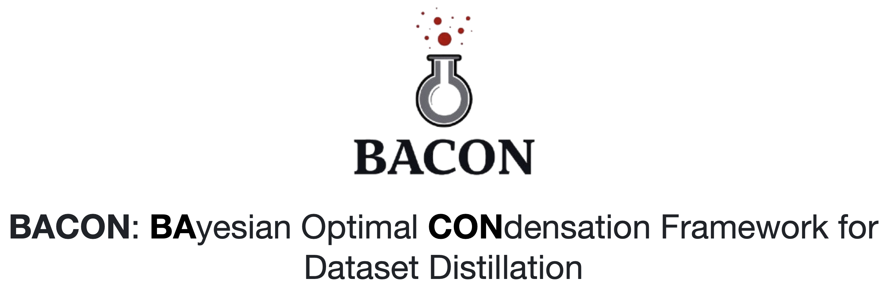
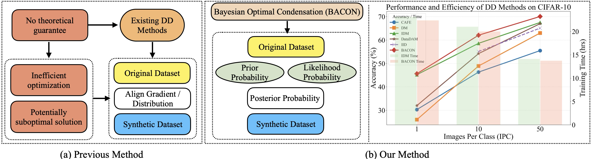
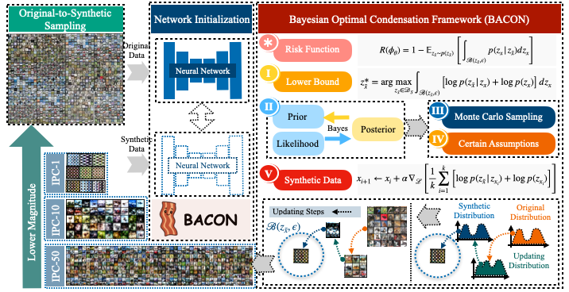
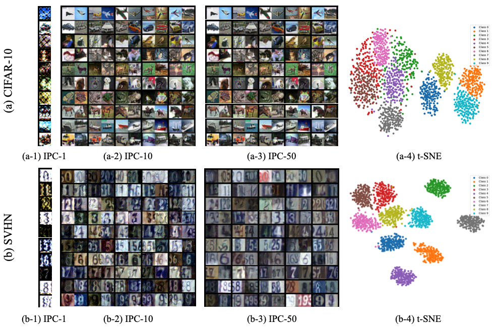
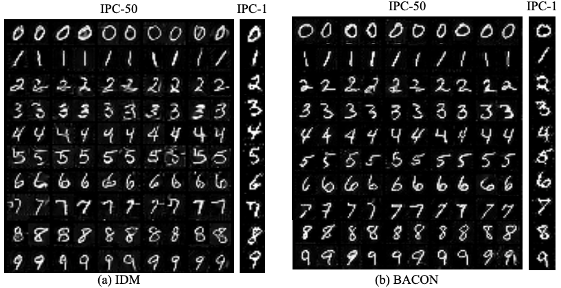
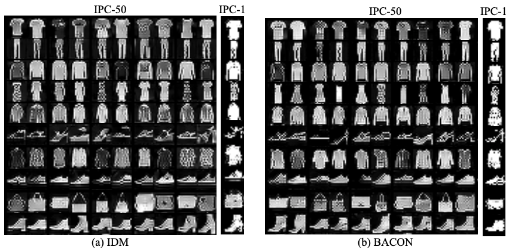
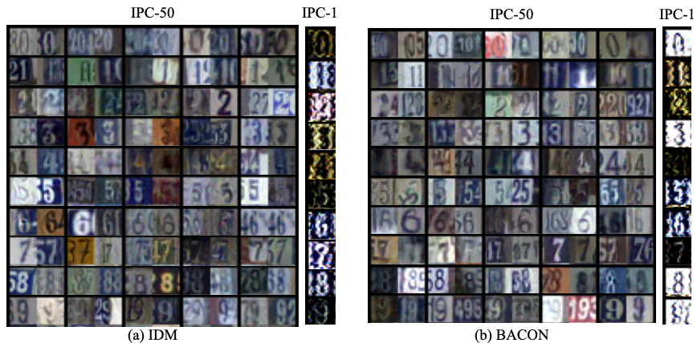
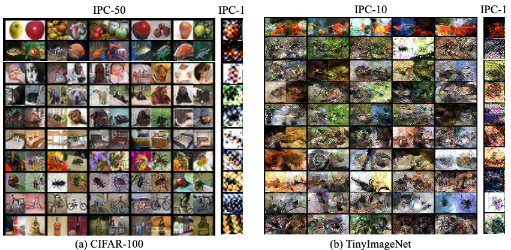

<p align="center">

</p>

### [Project Page](https://github.com/) | [Paper](https://arxiv.org/) | [Distilled Dataset](https://share.multcloud.link/share/f496af96-494a-4815-a7c9-e93cd95ecdd1)
This repository contains the code and implementation for the paper "**BACON: Bayesian Optimal Condensation Framework for Dataset Distillation**".
<!-- ## 👨‍💻 Authors

- [Zheng Zhou](https://zhouzhengqd.github.io/)<sup>1</sup>, [Hongbo Zhao](https://shi.buaa.edu.cn/09698/zh_CN/index.htm)<sup>1</sup>, [Guangliang Cheng](https://sites.google.com/view/guangliangcheng)<sup>2</sup>, [Xiangtai Li](https://lxtgh.github.io/)<sup>3</sup>, [Shuchang Lyu*](https://scholar.google.com/citations?user=SwGcxzMAAAAJ&hl=en)<sup>1</sup>, [Wenquan Feng](https://shi.buaa.edu.cn/fengwenquan/zh_CN/index/132879/list/)<sup>1</sup>, and [Qi Zhao](https://shi.buaa.edu.cn/07297/zh_CN/index.htm)<sup>1</sup> (* Corresponding Author)
- <sup>1</sup>[Beihang Univerisity](https://www.buaa.edu.cn/), <sup>2</sup>[University of Liverpool](https://www.liverpool.ac.uk/), and <sup>3</sup>[Nanyang Technological University](https://www.ntu.edu.sg/)
  
📧 For inquiries, please reach out via email: zhengzhou@buaa.edu.cn. Feel free to ask any questions! -->
## 🔍 Overview
<p align="center">

  <figcaption><strong>Figure 1:</strong> Comparison of BACON and existing DD methods: (a) Traditional methods align gradients and distributions on original and synthetic datasets. (b) BACON models DD as a Bayesian optimization problem, generating synthetic images by assessing likelihood and prior probabilities, thereby improving accuracy and reducing training costs.</figcaption>
</p>
 
> **Abstract** Dataset Distillation (DD) aims to condense large datasets into compact synthetic sets that preserve performance on unseen data, thereby reducing storage and training costs. However, most existing methods emphasize empirical performance without solid theoretical grounding, leaving issues such as optimization inefficiency and the lack of theoretical guarantees against suboptimal solutions unresolved. To bridge this gap, we propose the  <u>**BA**</u>yesian Optimal <u>**CON**</u>densation Framework (<u>**BACON**</u>), the first to incorporate a Bayesian perspective into dataset distillation. BACON offers a principled probabilistic formulation by casting DD as a Bayesian optimization problem, addressing the lack of Bayesian theoretical analysis in prior methods. To characterize the fundamental limits of DD, we derive a numerically tractable lower bound on the expected risk over the joint distribution of latent variables, which provides a theoretical performance limit. Under mild assumptions, we further obtain an approximate solution that enables practical data synthesis through likelihood estimation and prior knowledge. We evaluate BACON against 19 state-of-the-art methods on six standard image classification benchmarks under various images-per-class (IPC) settings. In the IPC-10 scenario on CIFAR-10, BACON achieves a 25.26\% accuracy improvement, including 15.76\% over distribution-based methods and 3.46\% over IDM, the second-best approach, while also reducing synthesis and training costs. These results highlight the theoretical soundness and practical advantages of BACON in dataset distillation.

## 🚀 Contributions
<p align="center">

  <figcaption><strong>Figure 2:</strong> BACON formulates dataset distillation as risk minimization over embeddings generated by a network within a Bayesian framework (Step I). The prior and likelihood from real data (Step II) inform posterior estimation (Step III). Monte Carlo sampling (Step IV) accelerates optimization, while gradient descent (Step V) refines synthetic data to better approximate the original distribution.</figcaption>
</p>

- **First Bayesian DD Framework:** We are the *first* to introduce a Bayesian framework for dataset distillation, modeling it as a **Bayesian optimization problem**. This provides a principled theoretical foundation for analyzing and improving distillation performance.

- **Theoretical Lower Bound:** Under Bayesian assumptions, we derive a **numerically tractable lower bound** for the optimal condensation objective, offering theoretical guarantees for the distilled data quality.

- **Efficient Distillation Algorithm:** We propose BACON, an efficient method that minimizes expected risk over joint distributions. Leveraging a Gaussian prior and a total variance constraint, BACON introduces new loss terms that **guide the optimization**.

- **Superior Empirical Performance:** Extensive experiments on multiple image classification benchmarks show that BACON **consistently outperforms prior methods**. It also generalizes well as a plug-in component to enhance other distillation techniques.

## 📈 Experimental Results
We showcase results for representative methods, including [DM](https://github.com/VICO-UoE/DatasetCondensation), [IDM](https://github.com/uitrbn/IDM), and our proposed BACON. In total, we compare 19 dataset distillation methods across 6 benchmarks, with additional methods such as [MTT](https://github.com/GeorgeCazenavette/mtt-distillation), [DataDAM](https://github.com/DataDistillation/DataDAM/), [RDED](https://github.com/LINs-lab/RDED/) and [IID](https://github.com/VincenDen/IID/) detailed in the full paper. All distilled datasets are publicly available at [Distilled Dataset](https://share.multcloud.link/share/f496af96-494a-4815-a7c9-e93cd95ecdd1).
<!-- (https://drive.google.com/drive/folders/1hZCowM21nfSOkRtm8VuK1lEpP7Bd1jCq?usp=sharing). -->
### Comparison to the State-of-the-art Methods
- **IPC-50**

| Method | MNIST | Fashion-MNIST | SVHN | CIFAR-10 | CIFAR-100 | TinyImageNet |
| :------: | :-----:  | :----: | :-----: | :----: |:----: |:----: | 
| **DM** | 94.8 | - | 82.6 | 63.0 | 43.6 | - |
| **IDM** | 97.01 | 84.03 | 84.1 | 67.5 | 50.0 | - |
| **BACON** | 98.01 | 85.52 | 89.1 | 70.06 | 52.29 | - | 
- **IPC-10**

| Method | MNIST | Fashion-MNIST | SVHN | CIFAR-10 | CIFAR-100 | TinyImageNet |
| :------: | :-----:  | :----: | :-----: | :----: |:----: |:----: | 
| **DM** | 97.3 | - | 72.8 | 48.9 | 29.7 | 12.9 |
| **IDM** | 96.26 | 82.53 | 81.0 | 58.6 | 45.1 | 21.9 |
| **BACON** | 97.3 | 84.23 | 84.64 | 62.06 | 46.15 | 25.0 | 
- **IPC-1**

| Method | MNIST | Fashion-MNIST | SVHN | CIFAR-10 | CIFAR-100 | TinyImageNet |
| :------: | :-----:  | :----: | :-----: | :----: |:----: |:----: | 
| **DM** | 89.2 | - | 21.6 | 26.0 | 11.4 | 3.9 |
| **IDM** | 93.82 | 78.23 | 65.3 | 45.2 | 20.1 | 10.1 |
| **BACON** | 94.15 | 78.48 | 69.44 | 45.62 | 23.68 | 10.2 | 
### Visulizations
<!--  -->



<!--  -->
## 🚀 Getting Started
### Step 1
- Run the following command to download the Repo.
  ```
  git clone https://github.com/zhouzhengqd/BACON.git
  ```
### Step 2
- Download Datasets (MNIST, Fashion-MNIST, SVHN, CIFAR-10, CIFAR-100, Tiny-ImageNet). 
<!-- - at [Dataset](https://drive.google.com/drive/folders/1hZCowM21nfSOkRtm8VuK1lEpP7Bd1jCq?usp=sharing). -->
### Step 3
- Run the following command to create a conda environment
    ```
    cd BACON
    cd Code
    conda env create -f environment.yml
    conda activate bacon
    ```
## 📁 Directory Structure
- BACON
    - Code
        - data
          - datasets
        - checkpoints
        - result
        - Files for BACON
        - enviroment.yml
        - ...
        - ...
        - ...

## 🛠️ Command for Reproducing Experiment Results and Evaluation
- For example: Validate on the MNIST, other datasets follow the "Command.txt" file.
- BACON MNIST IPC-50
  ```
    python3 -u BACON_mnist.py --dataset MNIST --model ConvNet --ipc 50 --dsa_strategy color_crop_cutout_flip_scale_rotate --init real --lr_img 0.2 --num_exp 5 --num_eval 5 --net_train_real --eval_interval 100 --outer_loop 1 --mismatch_lambda 0 --net_decay --embed_last 1000 --syn_ce --ce_weight 0.5 --train_net_num 1 --aug
  ```
- BACON MNIST IPC-10
  ```
    python3 -u BACON_mnist.py --dataset MNIST --model ConvNet --ipc 10 --dsa_strategy color_crop_cutout_flip_scale_rotate --init real --lr_img 0.2 --num_exp 5 --num_eval 5 --net_train_real --eval_interval 100 --outer_loop 1 --mismatch_lambda 0 --net_decay --embed_last 1000 --syn_ce --ce_weight 0.5 --train_net_num 1 --aug
  ```
- BACON MNIST IPC-1
  ```
    python3 -u BACON_mnist.py --dataset MNIST --model ConvNet --ipc 1 --dsa_strategy color_crop_cutout_flip_scale_rotate --init real --lr_img 0.2 --num_exp 5 --num_eval 5 --net_train_real --eval_interval 100 --outer_loop 1 --mismatch_lambda 0 --net_decay --embed_last 1000 --syn_ce --ce_weight 0.5 --train_net_num 1 --batch_real 5000 --net_generate_interval 5 --aug
  ```
## 🙏 Acknowledge
We gratefully acknowledge the contributors of DC-bench and IDM, as our code builds upon their work ([DC-bench](https://github.com/justincui03/dc_benchmark?tab=readme-ov-file) and [IDM](https://github.com/uitrbn/IDM)).
<!-- ## 📚 Citation
```
@article{zhou2024bacon,
  title={BACON: Bayesian Optimal Condensation Framework for Dataset Distillation},
  author={Zhou, Zheng and Zhao, Hongbo and Cheng, Guangliang and Li, Xiangtai and Lyu, Shuchang and Feng, Wenquan and Zhao, Qi},
  journal={arXiv preprint arXiv:2406.01112},
  year={2024}
}
``` -->
<!-- ## 🌟 Star History

[](https://star-history.com/#zhouzhengqd/BACON&Date) -->