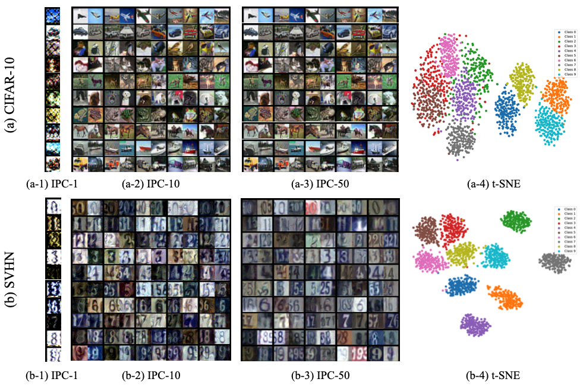
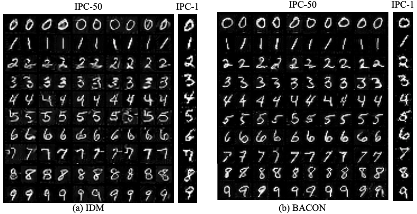
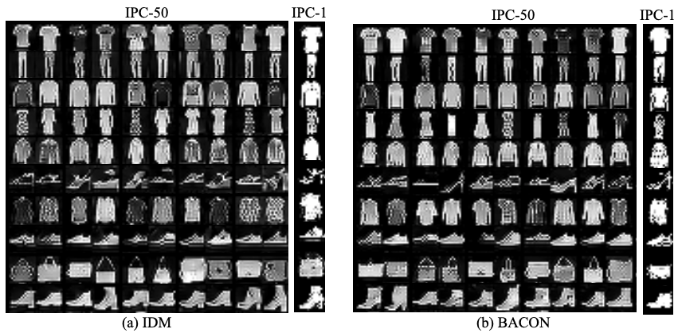
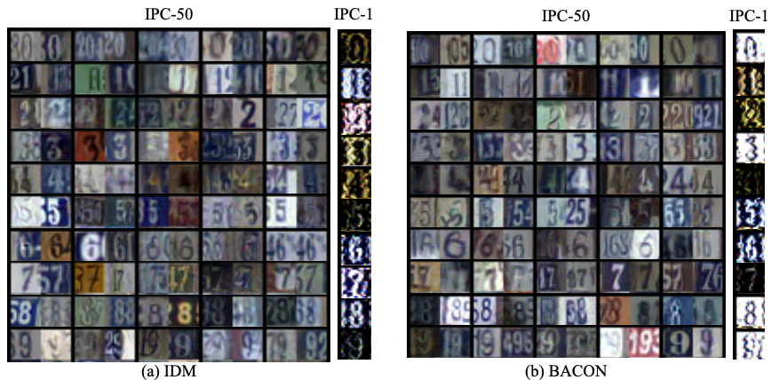
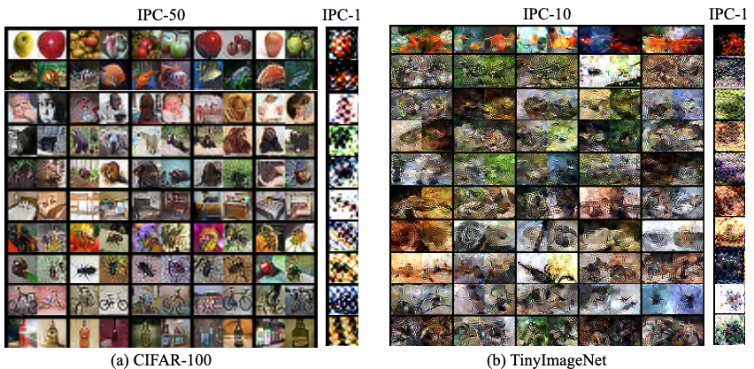

# BACON: Bayesian Optimal Condensation Framework for Dataset Distillation
Official PyTorch implementation of **"[BACON: Bayesian Optimal Condensation Framework for Dataset Distillation](https://arxiv.org/)"**.
<!-- , submitted to **NeurIPS'25** -->



> **Abstract** *Dataset Distillation (DD) aims to distill knowledge from extensive datasets into more compact ones while preserving performance on the test set, thereby reducing storage costs and training expenses. However, existing methods often suffer from computational intensity, particularly exhibiting suboptimal performance with large dataset sizes due to the lack of a robust theoretical framework for enhancing distillation effectiveness in DD tasks. To address these challenges, we propose the <u>**BA**</u>yesian optimal <u>**CON**</u>densation framework (<u>**BACON**</u>), which, to the best of our knowledge, is the first work to introduce the Bayesian theoretical framework to the literature of DD, providing theoretical support for improving its distillation performance. Furthermore, BACON formulates the DD problem as the minimization of the expected risk function in joint probability distributions using the Bayesian framework. Additionally, by analyzing the expected risk function for optimal condensation, we derive a numerically feasible lower bound based on specific assumptions, providing an approximate solution for BACON. We validate BACON across several datasets, demonstrating its superior performance compared to existing state-of-the-art methods. For instance, on the CIFAR-100 dataset, BACON achieves a 20\% accuracy gain, and on the SVHN dataset, BACON achieves a remarkable performance gain of up to 38\%. Our extensive experiments confirm the effectiveness of BACON and its seamless integration with existing methods, thereby enhancing their performance for the DD task. Code and distilled datasets are available at [BACON](https://github.com/zhouzhengqd/BACON).* 

## Experimental Results
The distilled datasets are available on the [Data Drive](https://drive.google.com/drive/folders/1hZCowM21nfSOkRtm8VuK1lEpP7Bd1jCq?usp=sharing).
### Comparison to the State-of-the-art Methods
- **IPC-50**

| Method | MNIST | Fashion-MNIST | SVHN | CIFAR-10 | CIFAR-100 | Tiny-ImageNet |
| :------: | :-----:  | :----: | :-----: | :----: |:----: |:----: | 
| **DM** | 94.8 | - | - | 63 | 43.6 | - |
| **IDM** | 97.01 | 84.03 | 87.5 | 67.5 | 50 | - |
| **BACON** | 98.01 | 85.52 | 89.1 | 70.06 | 52.29 | - | 
- **IPC-10**

| Method | MNIST | Fashion-MNIST | SVHN | CIFAR-10 | CIFAR-100 | Tiny-ImageNet |
| :------: | :-----:  | :----: | :-----: | :----: |:----: |:----: | 
| **DM** | 94.3 | - | - | 48.9 | 29.7 | 12.9 |
| **IDM** | 96.26 | 82.53 | 82.95 | 58.6 | 45.1 | 21.9 |
| **BACON** | 97.3 | 84.23 | 84.64 | 62.06 | 46.15 | 25 | 
- **IPC-1**

| Method | MNIST | Fashion-MNIST | SVHN | CIFAR-10 | CIFAR-100 | Tiny-ImageNet |
| :------: | :-----:  | :----: | :-----: | :----: |:----: |:----: | 
| **DM** | 89.2 | - | - | 26 | 11.4 | 3.9 |
| **IDM** | 93.82 | 78.23 | 69.45 | 45.60 | 20.1 | 10.1 |
| **BACON** | 94.15 | 78.48 | 69.04 | 45.62 | 23.68 | 10.2 | 
### Visulizations




## Getting Started
### Step 1
- Run the following command to download the Repo.
  ```
  git clone https://github.com/zhouzhengqd/BACON.git
  ```
### Step 2
- Download Datasets (MNIST, Fashion-MNIST, SVHN, CIFAR-10, CIFAR-100, Tiny-ImageNet)
### Step 3
- Run the following command to create a conda environment
    ```
    cd bacon
    conda env create -f environment.yml
    ```
## Command for Reproducing Experiment Results and Evaluation
- For example: Validate on the MNIST, other datasets follow the "Command.txt" file.
- BACON MNIST IPC-50
  ```
    python3 -u BACON_mnist.py --dataset MNIST --model ConvNet --ipc 50 --dsa_strategy color_crop_cutout_flip_scale_rotate --init real --lr_img 0.2 --num_exp 5 --num_eval 5 --net_train_real --eval_interval 100 --outer_loop 1 --mismatch_lambda 0 --net_decay --embed_last 1000 --syn_ce --ce_weight 0.5 --train_net_num 1 --aug
  ```
- BACON MNIST IPC-10
  ```
    python3 -u BACON_mnist.py --dataset MNIST --model ConvNet --ipc 10 --dsa_strategy color_crop_cutout_flip_scale_rotate --init real --lr_img 0.2 --num_exp 5 --num_eval 5 --net_train_real --eval_interval 100 --outer_loop 1 --mismatch_lambda 0 --net_decay --embed_last 1000 --syn_ce --ce_weight 0.5 --train_net_num 1 --aug
  ```
- BACON MNIST IPC-1
  ```
    python3 -u BACON_mnist.py --dataset MNIST --model ConvNet --ipc 1 --dsa_strategy color_crop_cutout_flip_scale_rotate --init real --lr_img 0.2 --num_exp 5 --num_eval 5 --net_train_real --eval_interval 100 --outer_loop 1 --mismatch_lambda 0 --net_decay --embed_last 1000 --syn_ce --ce_weight 0.5 --train_net_num 1 --batch_real 5000 --net_generate_interval 5 --aug
  ```
## Acknowledge
We gratefully acknowledge the contributors of DC-bench and IDM, as our code builds upon their work ([DC-bench](https://github.com/justincui03/dc_benchmark?tab=readme-ov-file) and [IDM](https://github.com/uitrbn/IDM)).
<!-- ## Citation
```
@inproceedings{zhengnips24,
title = {BACON: Bayesian Optimal Condensation Framework for Dataset Distillation},
author = {Zheng Zhou, Hongbo Zhao, Guangliang Cheng, Xiangtai Li, ShuChang Lyu, Wenquan Feng, Qi Zhao},
booktitle = {Conference and Workshop on Neural Information Processing Systems (NeurIPS)},
year = {2024}
}
``` -->