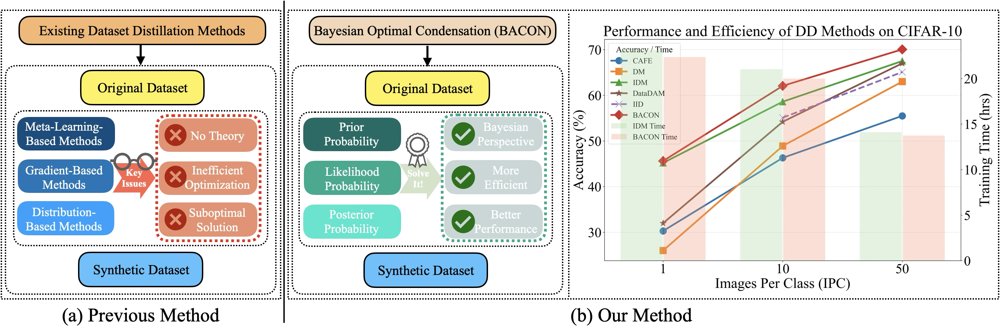
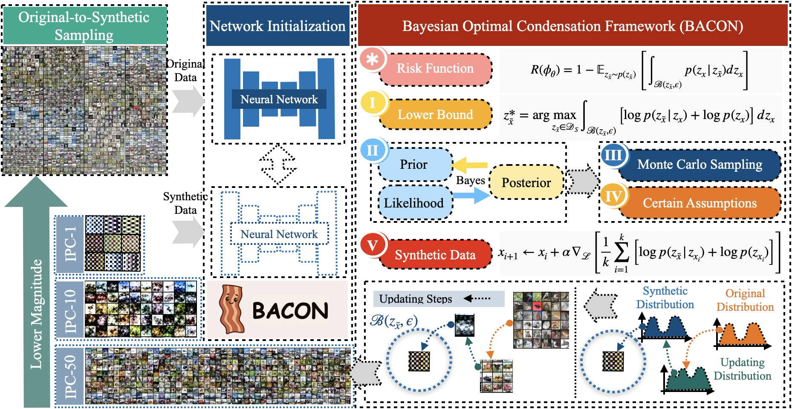

<p align="center">

</p>

### [Project Page](https://github.com/) | [Paper](https://arxiv.org/) | [Distilled Dataset](https://share.multcloud.link/share/f496af96-494a-4815-a7c9-e93cd95ecdd1)
This repository contains the code and implementation for the paper "**BACON: Bayesian Optimal Condensation Framework for Dataset Distillation**".
<!-- ## 👨‍💻 Authors

- [Zheng Zhou](https://zhouzhengqd.github.io/)<sup>1</sup>, [Hongbo Zhao](https://shi.buaa.edu.cn/09698/zh_CN/index.htm)<sup>1</sup>, [Guangliang Cheng](https://sites.google.com/view/guangliangcheng)<sup>2</sup>, [Xiangtai Li](https://lxtgh.github.io/)<sup>3</sup>, [Shuchang Lyu*](https://scholar.google.com/citations?user=SwGcxzMAAAAJ&hl=en)<sup>1</sup>, [Wenquan Feng](https://shi.buaa.edu.cn/fengwenquan/zh_CN/index/132879/list/)<sup>1</sup>, and [Qi Zhao](https://shi.buaa.edu.cn/07297/zh_CN/index.htm)<sup>1</sup> (* Corresponding Author)
- <sup>1</sup>[Beihang Univerisity](https://www.buaa.edu.cn/), <sup>2</sup>[University of Liverpool](https://www.liverpool.ac.uk/), and <sup>3</sup>[Nanyang Technological University](https://www.ntu.edu.sg/)
  
📧 For inquiries, please reach out via email: zhengzhou@buaa.edu.cn. Feel free to ask any questions! -->
## 🔍 Overview
<p align="center">

  <figcaption><strong>Figure 1:</strong> Comparison of our method with previous methods: (a) Existing DD methods typically align gradients and distributions, but lack theoretical guarantees. (b) BACON models DD as a Bayesian optimization problem, generating synthetic images by assessing likelihood and prior probabilities, thereby improving accuracy and reducing training costs.</figcaption>
</p>
 
> **Abstract** <u>**BACON**</u> (<u>**BA**</u>yesian Optimal <u>**CON**</u>densation Framework) introduces a Bayesian framework to Dataset Distillation (DD), offering a principled probabilistic approach that addresses the lack of theoretical grounding in existing methods. By formulating DD as a Bayesian optimization problem, BACON derives a numerically tractable lower bound on expected risk, facilitating efficient data synthesis. Evaluated on multiple image classification benchmarks, BACON consistently outperforms state-of-the-art methods, achieving significant accuracy gains while reducing both synthesis and training costs.

## 🚀 Contributions
<p align="center">

  <figcaption><strong>Figure 2:</strong> Overview of BACON: BACON formulates DD as Bayesian risk minimization over embeddings (*), and derives a tractable lower bound for optimization (I), guided by prior and likelihood from the original data (II). Monte Carlo sampling accelerates optimization (III), and a loss is constructed under two assumptions (IV) to update synthetic data via gradient descent (V).</figcaption>
</p>

- **First Bayesian DD Framework:** We are the *first* to introduce a Bayesian framework for dataset distillation, formulating it as a **Bayesian optimization problem** that minimizes the expected risk. We derive a theoretical lower bound on the expected risk over the joint distribution of latent variables, providing new insights into the fundamental limits of optimal condensation.

- **Efficient Distillation Algorithm:** We propose the **BACON** framework (Bayesian optimal CONdensation), an efficient method that minimizes the expected risk for dataset distillation. By incorporating key assumptions such as a Gaussian prior and a total variance constraint, BACON derives loss terms to effectively guide the distillation process.

- **Superior Empirical Performance:** Extensive experiments comparing BACON with various dataset distillation methods across multiple image classification datasets demonstrate that BACON consistently outperforms all methods, showcasing superior performance in both accuracy and efficiency.


## 📈 Experimental Results

We present results for several representative methods, including [DM](https://github.com/VICO-UoE/DatasetCondensation), [IDM](https://github.com/uitrbn/IDM), and our proposed BACON. In total, we compare 18 existing methods across 4 datasets. Additional methods such as [MTT](https://github.com/GeorgeCazenavette/mtt-distillation), [DataDAM](https://github.com/DataDistillation/DataDAM/), and [IID](https://github.com/VincenDen/IID/) are also evaluated, with further details available in the full paper. 

All distilled datasets are publicly accessible at [Distilled Dataset](https://share.multcloud.link/share/f496af96-494a-4815-a7c9-e93cd95ecdd1).

<!-- (https://drive.google.com/drive/folders/1hZCowM21nfSOkRtm8VuK1lEpP7Bd1jCq?usp=sharing). -->
### Comparison to the State-of-the-art Methods
- **IPC-50**

| Method | SVHN | CIFAR-10 | CIFAR-100 | TinyImageNet |
| :----: | :-----: | :----: |:----: |:----: | 
| **DM** | 82.6 | 63.0 | 43.6 | - |
| **IDM** | 84.1 | 67.5 | 50.0 | - |
| **BACON** | 89.1 | 70.06 | 52.29 | - | 
- **IPC-10**

| Method | SVHN | CIFAR-10 | CIFAR-100 | TinyImageNet |
| :------: | :-----: | :----: |:----: |:----: | 
| **DM** | 48.9 | 29.7 | 12.9 |
| **IDM** | 81.0 | 58.6 | 45.1 | 21.9 |
| **BACON** | 84.64 | 62.06 | 46.15 | 25.0 | 
- **IPC-1**

| Method | SVHN | CIFAR-10 | CIFAR-100 | TinyImageNet |
| :------: | :-----: | :----: |:----: |:----: | 
| **DM** | 26.0 | 11.4 | 3.9 |
| **IDM** | 65.3 | 45.2 | 20.1 | 10.1 |
| **BACON** | 69.44 | 45.62 | 23.68 | 10.2 | 
### Visulizations
<!--  -->


<!--  -->
## 🚀 Getting Started
### Step 1
- Run the following command to download the Repo.
  ```
  git clone https://github.com/zhouzhengqd/BACON.git
  ```
### Step 2
- Download Datasets (SVHN, CIFAR-10, CIFAR-100, Tiny-ImageNet). 
<!-- - at [Dataset](https://drive.google.com/drive/folders/1hZCowM21nfSOkRtm8VuK1lEpP7Bd1jCq?usp=sharing). -->
### Step 3
- Run the following command to create a conda environment
    ```
    cd BACON
    cd Code
    conda env create -f environment.yml
    conda activate bacon
    ```
## 📁 Directory Structure
- BACON
    - Code
        - data
          - datasets
        - checkpoints
        - result
        - Files for BACON
        - enviroment.yml
        - ...
        - ...
        - ...

## 🛠️ Command for Reproducing Experiment Results and Evaluation
- For example: Validate on the CIFAR-10, other datasets follow the "Command.txt" file.
- BACON CIFAR-10 IPC-50
  ```
    python3 -u BACON_cifar10.py --dataset CIFAR10 --model ConvNet --ipc 50 --dsa_strategy color_crop_cutout_flip_scale_rotate --init real --lr_img 0.2 --num_exp 5 --num_eval 5 --net_train_real --eval_interval 500 --outer_loop 1 --mismatch_lambda 0 --net_decay --embed_last 1000 --syn_ce --ce_weight 0.1 --train_net_num 1 --aug
  ```
- BACON CIFAR-10 IPC-10
  ```
    python3 -u BACON_cifar10.py --dataset CIFAR10 --model ConvNet --ipc 10 --dsa_strategy color_crop_cutout_flip_scale_rotate --init real --lr_img 0.2 --num_exp 5 --num_eval 5 --net_train_real --eval_interval 100 --outer_loop 1 --mismatch_lambda 0 --net_decay --embed_last 1000 --syn_ce --ce_weight 0.5 --train_net_num 1 --aug
  ```
- BACON CIFAR-10 IPC-1
  ```
    python3 -u BACON_cifar10.py --dataset CIFAR10 --model ConvNet --ipc 1 --dsa_strategy color_crop_cutout_flip_scale_rotate --init real --lr_img 0.2 --num_exp 5 --num_eval 5 --net_train_real --eval_interval 100 --outer_loop 1 --mismatch_lambda 0 --net_decay --embed_last 1000 --syn_ce --ce_weight 0.5 --train_net_num 1 --batch_real 5000 --net_generate_interval 5 --aug
  ```
## 🙏 Acknowledge
We gratefully acknowledge the contributors of DC-bench and IDM, as our code builds upon their work ([DC-bench](https://github.com/justincui03/dc_benchmark?tab=readme-ov-file) and [IDM](https://github.com/uitrbn/IDM)).
<!-- ## 📚 Citation
```
@article{zhou2024bacon,
  title={BACON: Bayesian Optimal Condensation Framework for Dataset Distillation},
  author={Zhou, Zheng and Zhao, Hongbo and Cheng, Guangliang and Li, Xiangtai and Lyu, Shuchang and Feng, Wenquan and Zhao, Qi},
  journal={arXiv preprint arXiv:2406.01112},
  year={2024}
}
``` -->
<!-- ## 🌟 Star History

[](https://star-history.com/#zhouzhengqd/BACON&Date) -->